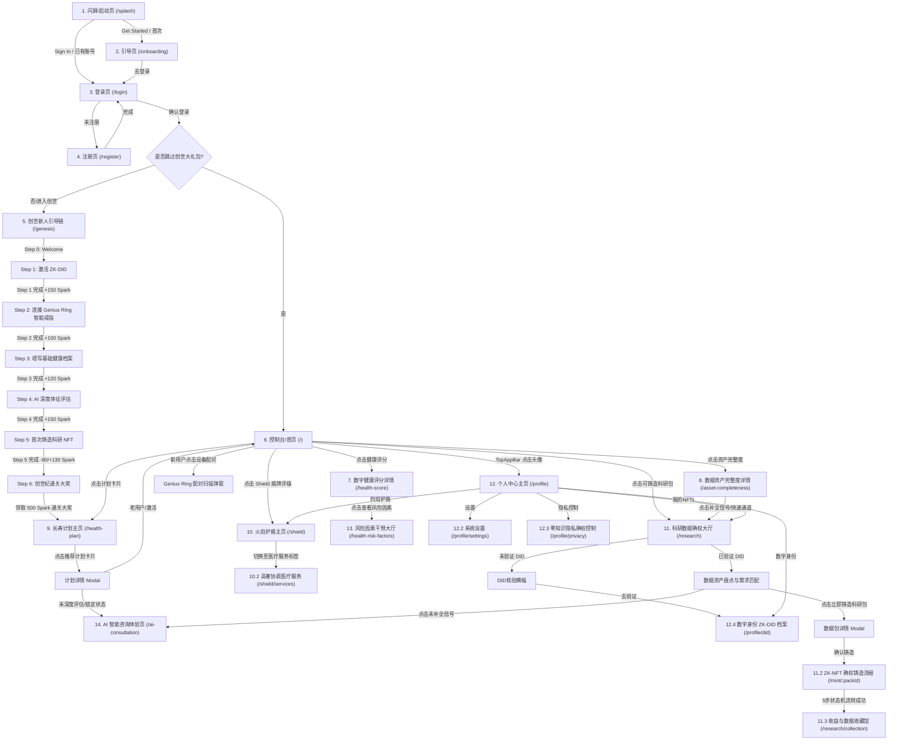

# MIO 尊贵用户端页面全景技术架构说明书

本文档提供了 MIO（长寿资产健康控制台与 Web3 确权应用）中所有用户端页面的深度解剖。包含页面定位、技术结构、交互逻辑、全局状态机流转及完整的页面跳转拓扑网络。

---

## 1. 核心状态机与数据流转 (State Engine)

MIO 采用零知识隐私机制与演示状态机（`DemoStateContext`）来控制整个 App 的新手引导与已解锁老用户的高级交互。

### 1.1 关键状态变量 (Global States)
- `isGenesisCompleted` (布尔值): 创世新人任务链通关状态。
- `isDidVerified` (布尔值): 用户 ZK-DID（零知识数字身份）是否已验证。
- `hasActivePlans` (布尔值): 用户是否激活了长寿健康计划。
- `showDebugBall` (布尔值): 是否展示悬浮调试控制球。

### 1.2 散装本地变量的双向绑定 (Local Storage Hooks)
- `genesisCompleted` $\leftrightarrow$ `isGenesisCompleted` (通关会一键点亮全部子任务：`tutorialCompleted`, `did_verified`, `device_connected`, `isDeepAssessed`, `firstPlanActivated`, `nft_minted`, `genesisStep = 4`)。
- `did_verified` $\leftrightarrow$ `isDidVerified`。
- `firstPlanActivated` $\leftrightarrow$ `hasActivePlans`。

---

## 2. 页面拓扑跳转关系图 (Mermaid Topology)

---

## 3. 用户端页面清单与交互解剖 (Page Catalog)

### 3.1 非布局路由（Auth & Genesis 流程，无底部导航栏）

#### 1. 闪屏/启动体验页 (`/splash` - `SplashScreen`)
- **视觉美学**: 极光晕圈背景（`AuroraOrbs`）、三维颗粒漂浮（`ParticleField`）、Canvas 动态基因神经网络连线交互（`GeneNetwork`），高奢科技质感。
- **页面状态**:
  - `loading` 阶段: 进度条以 0 $\to$ 30 $\to$ 60 $\to$ 80 $\to$ 95 $\to$ 100 步进。提示文字依次变化：*Initializing genome engine...* $\to$ *Loading health models...* $\to$ *Securing DID vault...*
  - `ready` 阶段: 渐入式浮现 "Get Started" 按钮与 "Already have an account? Sign In" 链接。
- **跳转逻辑**:
  - 点击 "Get Started" $\to$ 若本地 `hasSeenOnboarding` 为 `true` 则去 `/login`，否则去 `/onboarding`。
  - 点击 "Sign In" $\to$ `/login`。

#### 2. Onboarding 引导页 (`/onboarding` - `Onboarding`)
- **交互逻辑**: 轮播式的长寿主权精神宣导，讲解 MIO 如何通过零知识证明保护健康隐私并获取科研产出。
- **跳转逻辑**: 点击完成跳转至登录页 `/login`，并向本地存储写入 `hasSeenOnboarding: 'true'`。

#### 3. 登录与注册页 (`/login` & `/register` - `LoginPage` & `RegisterPage`)
- **交互逻辑**: 极具现代感的账号密码及第三方快捷输入表单，带表单校验、安全密码遮罩和动态加载。
- **跳转逻辑**: 注册成功后去 `/login`，登录成功后去创世纪任务链 `/genesis`（如果未完成新手流程），否则重定向去主控制台 `/`。

#### 4. 创世新人任务链主导页 (`/genesis` - `GenesisJourney`)
- **页面定位**: 这是新用户最核心的新手激励任务链，通过游戏化的机制吸引用户了解并点亮所有健康资产模块。
- **页面状态 & 奖励流转**:
  - **Step 0: Welcome Gate** $\to$ 创世迎宾门，点击开启新手大礼包（或可选择“跳过所有”直接跳去主控台 `/`）。
  - **Step 1: Activate ZK-DID** $\to$ 激活零知识数字身份档案，完成奖励 **+150 Spark**。
  - **Step 2: Connect Health** $\to$ 连接传感器与可穿戴设备（例如 Genius Ring），完成奖励 **+100 Spark**。
  - **Step 3: Health Profile** $\to$ 录入日常作息与体征简表，完成奖励 **+120 Spark**。
  - **Step 4: AI Assessment** $\to$ 发起 MIO 智能 AI 深度健康分析与解读，完成奖励 **+150 Spark**。
  - **Step 5: First Mint** $\to$ 首次铸造个人科研数据 R-NFT。扣减 80 Spark 铸造，铸造完成返还奖励 **+130 Spark**。
  - **Step 6: Genesis Complete** $\to$ 创世特权圆满达成！解锁大额 **500 Spark** 创世终极大奖。
- **跳转逻辑**: 通关后点击完成，将 `genesisCompleted` 设为 `true` 并写入本地存储，直接将用户带到长寿计划主页 `/health-plan`。

---

### 3.2 布局路由（基于 `AppLayout`，带顶部状态及底部导航栏）

#### 5. 首页控制台 (`/` - `HomePage`)
- **视觉美学**: 背景自动循环播放高阶生物数字孪生渲染微视频（`hero_video.mp4`，支持在顶部栏暂停/播放）。当创世链通关时，首页会触发持续数秒的黄金碎屑雨（`Gold Rain`）炫酷通关动效，尊贵感直接拉满。
- **新用户模式 (Bento Mission Box)**:
  - 若 `isGenesisCompleted` 为 `false`，首页顶部会常驻极富现代拼贴感（Bento Box）的“创世纪任务大厅”看板。
  - 展示 4 大主线（确权隐私盾、智能生命天线、深度评估、激活计划）的细化进度条。
  - **智能设备扫描交互 (Genius Ring Link)**: 新人在此点击智能生命天线，会启动极高保真的智能戒指蓝牙连线匹配雷达动画。经历：`1. 正在搜寻戒指设备` $\to$ `2. 戒指已检测，请确认佩戴` $\to$ `3. 连接成功配对完美在线` 3 步高保真状态切换，完成后发放 50 Spark 奖励。
- **主资产面板 (Control Board)**:
  - **Health Score**: 实时渲染当前长寿体征分，未评估显示“评估中”，已评估显示“88”或“85 A”绿金卡片。
  - **Asset Completeness**: 实时渲染健康资产完整度百分比，未同步为“12%”，通关同步为“94%”。
  - **Mint Ready**: 待铸造 R-NFT 包计数。
  - **Shield Tier**: 隐私盾段位级别（Bronze 1 $\to$ Gold 3）。
- **设备联动滚动跑马灯**: 在下方循环跑马展示：*Genius Ring · CONNECTED* $\to$ *Smart Fabric · SYNCING* $\to$ *ZK-DID · SECURED* 等实时状态。
- **长寿 NFT 预备区 (Research NFT Progress)**: 进度条展示铸造就绪度（67%），展示预审合格可铸造数据包数量，并展示预估收益（例如 `180-260 GEF`）。

#### 6. 数字健康评分详情页 (`/health-score` - `HealthScorePage`)
- **定位**: 用户的“数字孪生”健康评分多维度诊断中心。
- **功能与状态**:
  - 显示大字评分 “85 A”，附有色彩斑斓的 Poor/Fair/Good/Excellent 四段状态轴。
  - 提供“健康风险提示入口卡片”，红色标明包含 1 项高风险与 2 项警告项目。
  - 嵌套渲染 `HealthOverview` 健康体征看板。
- **跳转逻辑**: 点击风险卡片 $\to$ 进入风险干预中心 `/health-risk-factors`。

#### 7. 数据资产完整度详情页 (`/asset-completeness` - `AssetCompletenessPage`)
- **定位**: 用户的健康数据主权资产盘点大厅。
- **功能与状态**:
  - 显示“当前资产丰富度评分”（如 67%），配合流光进度条与数据深度评估见解。
  - **多源数据源传感器列表**: 包含 Apple Health (已连)、Google Fit (已连)、Genius Ring (未连)、Smart Fabric (未连) 等设备的状态切换，并预留“添加新传感器”的虚线卡片。
  - **数据颗粒度仪表盘**: 拆分穿戴设备、问卷、物理体检、用药记录、基因面板、膳食记录等 6 大板块，绿色点亮代表已采集，灰色代表未同步。
  - **链上健康时间线**: 瀑布式流转展示“自动同步”、“睡眠质量数据上传”、“体检报告上传 (Highlight)”、“手动录入”等历史变更轴。

#### 8. 风险因素干预大厅 (`/health-risk-factors` - `HealthRiskFactorsPage`)
- **定位**: 高危/警示生理指标的诊断与介入大厅。
- **功能与状态**:
  - **高风险警告面板 (High Risk)**: 锁定“空腹血糖 (FBS)”为 112 mg/dL，配合红色高亮标签，解析其对表观遗传年龄的损伤。
  - **警示项目 (Caution)**: 锁定“睡眠干预心率变异性 (Sleep HRV)”为 42ms 以及“身体质量指数 (BMI)”为 26.4，附带 60% 与 75% 压迫警告指示条。
  - **已激活 AI 评估列表 (Available Assessments)**: 提供全基因组诊断（+250 Spark）、心血管负荷评估（+120 Spark）、细胞代谢重塑（+85 Spark）、表观遗传生物年龄（+400 Spark）的申请入口。

#### 9. 长寿协议计划大厅 (`/health-plan` - `HealthPlanPage`)
- **新用户模式 (Discovery Square)**:
  - 针对未完成深度健康评估的用户，展示“挑战广场 (Challenge Square)”，向用户推荐“间歇性细胞自噬计划”、“深睡抗衰重塑计划”等，但卡片详情及一键开启按钮处于“**未解锁**”状态，会弹窗警告“为了数据安全以及能够获得 AI 个性化长寿推荐，激活此日常健康计划需要先完成「深度健康评估」”，提供“立即评估”和置灰的“已锁定”按钮。
  - 展示官方验证的“机构与专家研究计划 (Expert & Institution)”，包括 Novartis（诺华）、东京长寿实验室的研究项目。
- **已评估用户模式 (longevity Protocols Mode)**:
  - **执行计划卡片 (Executing Plans)**: 包含 Novartis 或 Apple Health 数据源的激活任务、今日打卡行动、今日完成进度（如 2/3 个任务）、GEF 收益等，右侧显示“计划估值 (Plan Value)”面板（例如：$380 / year）。
  - **AI 推荐计划**: 显示 MIO AI 医疗助理专门为用户推荐的长寿习惯，绿色高亮展示“**AI 推荐依据：[AI 评估您的中度自主神经负荷偏高，此干预可提升迷走神经张力]**”。
  - **排队打卡任务流 (Plan Queue)**: 待开始、进行中、待验证、已完成的任务打卡组件。
  - **数据效果追踪 (Effect Tracking)**: 展示静息心率(BPM)下降百分比、每日步数提升百分比、深睡时长变化。
- **额度检查限制**: 用户最多能同时激活 **3 个日常/挑战计划**。若超过 3 个且激活非机构计划，系统会进行强力 toast 拦截：“日常/挑战计划已达 3 个上限！请先暂停一个现有计划。”（机构研究计划不计入此额度）。

#### 10. 火焰护盾主页与高奢医疗协调服务 (`/shield` & `/shield/services` - `ShieldLayout`)
- **火焰护盾主页 (FlameShield - `/shield`)**:
  - 展示隐私烈焰盾牌的宏伟渲染。
  - **状态机联动**:
    - 若创世未通关：显示评级为 Bronze 1，互助资金池为 20 GEF，特权解锁 1/3。金属卡片为低奢灰黑色渐变背景，带有低调的冷光。
    - 若创世已通关：评级变为 Gold 3，互助资金池为 450 GEF，权益评分为 95/100，特权解锁。金属卡片升级为黑金微粒流光渐变背景（`bg-gradient-to-br from-[#0a0a0a] via-[#1a1610] to-[#0a0a0a]`），散发金色华贵感。
  - 展示特权通道与晋升路径进度条（通关为 72% 金色流光，未通关为 12% 进度）。
- **专属高奢医疗服务 (ShieldServices - `/shield/services`)**:
  - 全球顶级协调医疗服务：
    1. **日本顶级精密癌筛**：涵盖 150+ 项癌症与心脑血管指标检测、VIP全程通道绿通协助。支持代币全额支付。
    2. **高价值细胞抗衰干预**：日本顶级诊所干细胞与外泌体抗衰咨询、长寿教练全程指导。
    3. **中美日绿色转诊通道**：Mayo/MD Anderson/日大医院肿瘤专科快速会诊名医预约通道。

#### 11. 科研数据确权大厅 (`/research` - `MyNFTs`)
- **定位**: 用户的去中心化健康资产确权大厅。
- **状态联动**:
  - **未验证 DID 状态**: 顶部显示 FAQ 常见问答，下方常驻一个大型“确权隐私盾未激活”卡片（`t('researchPage.guidance.mainTitle')`，按钮是“去激活 DID”）。
  - **已验证 DID 状态**: 顶部升级为数据资产盘点与信号流。
- **功能板块**:
  - **数据资产盘点**: 显示“待补全信号”标签（家族病史、基因面板、生物标志物分析、睡眠干预计划等），点击每个会跳转到对应的健康评分 `/health-score`、计划 `/health-plan` 或 AI 咨询 `/ai-consultation` 补全。
  - **数据科研包列表（R-NFT #0821 代谢健康数据包，R-NFT #0822 心血管健康数据包）**:
    - 显示状态：`isLocked`（若创世未通关，显示“创世未通关”并加锁，按钮灰掉无法点击；若已解锁且已铸造，显示“加速搜索匹配中...”；若未铸造，显示“立即铸造”并可打开资产详情弹窗）。
    - 投影年估值（如 `$1,250 / year`）。
  - **科研需求匹配与 ZK 证明日志流**: 血糖平衡、长寿机制等匹配度。右侧常驻黑色命令行风格的“零知识证明流 (Proof Stream)”日志终端。

#### 12. ZK-NFT 确权铸造流程 (`/mint/:packId` - `MintActionPage`)
- **定位**: 用于模拟通过零知识证明确权铸造科研 R-NFT 的高保真流程。
- **状态机流转 (5步状态机)**:
  1. `transaction_approval` $\to$ 展示 Action、Asset ID 及 Gas Fee，点击 "Confirm in Wallet" 启动钱包签名。
  2. `scanning` $\to$ 闪耀的雷达雷射扫描动画，显示“正在广播交易 (Broadcasting Tx)”，等待网络节点确认。
  3. `encrypting` $\to$ 挂锁图标和向上喷射的动态粒子流，提示“正在进行 ZK-Privacy 零知识隐私加密...”，保护体征隐私。
  4. `finalizing` $\to$ 动态方块确认动画，标语为“正在区块打包和确权注册...”。
  5. `success` $\to$ 3D 立体金属流光确权证书（NFT 卡片）从翻转中浮现。展示 R-NFT ID、所有者 DID (`did:flare:7e2f...91a2`)、数据完整度 (99.98%)、收益加成等级 (Tier S)，可一键点击“进入收益收藏馆”跳转去 `/research/collection`。

#### 13. 收益与数据收藏馆 (`/research/collection` - `CollectionPage`)
- **定位**: 展示用户已成功确权铸造的 R-NFT 详情及代币累计收益。
- **功能板块**:
  - 显示“收藏馆净资产 (Vault Net Worth)”：35.77 GEF。
  - 显示“年化复合收益率 (Annual Est. Yield / APR)”：+18.5%。
  - 展示旗下已铸造的 3 大 R-NFT (Metabolic S级, Cardio A级, Neuro S级)，包含各自的产出 GEF 代币计数与数据完整度，配合炫酷的极光晕圈阴影背景。

#### 14. AI 智能深度评估与长寿客服咨询 (`/ai-consultation` - `AIConsultationPage`)
- **定位**: 高互动式聊天式医疗人工智能助理。
- **交互逻辑 & 状态机**:
  - **诊断问题填充**: 监听 `location.state?.initialQuery`，从外部链接携带诊断意图跳转进来时会自动模拟发送该问题。
  - **极速打卡快捷操作面板 (Quick Actions)**: 底部提供折叠式的 6 大快速健康录入按钮（每日极速打卡、上传检查报告、录入生理数据、记录膳食、药物日志、填写健康问卷），点击会自动发送预设对话。如果是上传报告，对话中会派生出高保真的拖拽上传 UI。
  - **深度评估解锁状态机**: 只要用户发送的信息包含“评估”或“assessment”，AI 助理会进行深度多维核算并宣告评估完成，同时**将全局 `isDeepAssessed` 设为 `true` 写入 `localStorage`**，以此解锁长寿健康计划的详情与一键开启功能。

---

### 3.3 个人主页与安全配置

#### 15. 个人主页 (`/profile` - `ProfilePage`)
- **定位**: 用户信息、盾牌等级及相关设置的聚合主页。
- **跳转入口**: 包含“数字身份 (did)”、“隐私控制 (privacy)”、“我的科研 NFTs (nfts)”、“我的烈焰护盾 (flame-shield)”、“系统设置 (settings)”等入口。

#### 16. 系统设置 (`/profile/settings` - `Settings`)
- **交互逻辑**: 包含个人信息设置、多语言切换（中/英）、网络切换（Vite、Netlify）、主题风格切换等设置。

#### 17. 零知识隐私确权控制 (`/profile/privacy` - `PrivacyControl`)
- **定位**: MIO 极具 Web3 主权精神的隐私保护面板。
- **功能与状态**:
  - 针对 4 大类数据（穿戴设备、体检报告、问卷资产、基因面板），分别提供 3 个权限控制开关：
    1. AI 本地诊断分析权限（*_ai）
    2. 脱敏聚合池化权限（*_anon）
    3. 主权商业交易授权（*_trade）
  - 全局管理动作：暂停全部数据交易授权、终止脱敏聚合池化、导出全部加密数据、物理销毁全部链上痕迹销户。

#### 18. 数字身份 ZK-DID 档案 (`/profile/did` - `DigitalIdentityPage`)
- **定位**: 展示分布式数字身份 ZK-DID 的核验面板。
- **状态联动**:
  - **未验证状态**: id 显示 "did:flare:pending..."，Credit Score 为 "--"，已验证生物特征的状态全都是 "Disconnected"。底部悬浮“同步健康数据并核验 (SYNC HEALTH & VERIFY DID)”的巨型按钮。
  - **核验流交互**: 点击核验按钮，会展示 3 秒高保真“正在核验 ZK 证明 (GENERATING ZK-PROOF)...”加载状态。完成后更新 `localStorage.setItem('did_verified', 'true')` 写入本地，激活全局 DID。
  - **已验证状态**: 展示真正的 ZK-DID id、Credit Score（842 分）、Platinum Contributor 段位、3 项 Active 状态生物特征、以及 ZK 证明记录。

---

*文档版本：v2.0.0 · 最后更新日期：2026-05-28*
